# Industrial Edge Gateway

[中文文档](./README_CN.md)

Industrial Edge Gateway is a lightweight industrial edge computing gateway designed to connect industrial field devices (Southbound) with cloud/upper-layer applications (Northbound) and provide local edge computing capabilities. The project uses Go for the backend and Vue 3 for the frontend management interface.

<div align="center">
  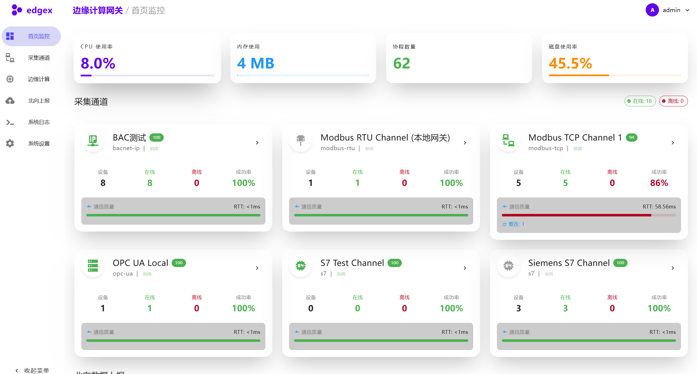
</div>

## ✨ Key Features

### 🔌 Southbound Protocols

| Protocol | Status | Description |
| :--- | :--- | :--- |
| **Modbus TCP / RTU / RTU Over TCP** | ✅ Implemented | Full support, based on `simonvetter/modbus`; **Smart Collection Optimization**: Supports auto-detecting slave MTU (max registers), exponential backoff reconnection, and fully automatic local port detection. **Enhanced Decoder**: Supports conversion and automatic scaling for multiple integer types like `int32`/`uint32`/`int16`/`uint16`. **Robustness**: Automatically identifies Illegal Data Addresses (Exception 2) and enters a 24-hour cooldown period to prevent invalid scans from slowing down collection efficiency |
| **BACnet IP** | ✅ Implemented | Supports device discovery (Who-Is/I-Am), multi-interface broadcast + unicast fallback (respects I-Am source port), object scanning and point read/write, automatic fallback to single read upon batch read failure, fallback to 47808 on abnormal ports, read timeout and automatic recovery optimization. **New Local Simulator Support**: Automatically attempts localhost unicast discovery for simulators running locally on Windows. |
| **OPC UA Client** | ✅ Implemented | Based on `gopcua/opcua`, supports read/write operations, Subscription and Monitoring, supports automatic reconnection on disconnection |
| **Siemens S7** | 🚧 In Development | Supports S7-200Smart/1200/1500 etc. (Custom Development) |
| **EtherNet/IP (ODVA)** | 🚧 In Development | Planned implementation |
| **Mitsubishi MELSEC (SLMP)** | 🚧 In Development | Planned implementation |
| **Omron FINS (TCP/UDP)** | 🚧 In Development | Planned implementation |
| **DL/T645-2007** | 🚧 In Development | Planned implementation |

### ☁️ Northbound Protocols

| Protocol | Status | Description |
| :--- | :--- | :--- |
| **MQTT** | ✅ Implemented | Supports custom Topic/Payload templates, batch point mapping and reverse control, provides server runtime monitoring (data statistics) |
| **Sparkplug B** | ✅ Implemented | Supports NBIRTH, NDEATH, DDATA message specifications |
| **OPC UA Server** | ✅ Implemented | Based on `awcullen/opcua`, supports multiple authentication methods (Anonymous/User/Certificate); **Security Enhancement**: Enables `Basic256Sha256` policy and certificate trust mechanism; **Bi-directional**: Supports client write operations (Cloud Control); provides server runtime monitoring (Client count/Subscription count/Write statistics) |

### 🧠 Edge Computing & Management

*   **Rule Engine**: Built-in lightweight rule engine supporting `expr` expressions for logic judgment and linkage control.
*   **Log System**:
    *   **Real-time Logs**: Supports WebSocket real-time push, pause/resume, log level filtering (INFO/WARN/ERROR, etc.), and clear screen.
    *   **Historical Logs**: Minute-level snapshot persistence (bbolt), supports query by date and CSV export.
    *   **UI Experience**: Modern console style, supports pagination (30 lines per page) and reverse ordering.
*   **Visual Management**:
    *   Modern UI based on Vue 3 + Vuetify.
    *   **Channel Monitoring**: Supports real-time TCP connection status, including Local IP:Port, Remote IP:Port, connection duration, and last disconnect time, with intuitive "Local -> Remote" link display.
    *   **Point Management Upgrade**:
        *   **Batch Operations**: Supports batch deletion of points to simplify large-scale maintenance.
        *   **Reactive Filtering**: Point list supports real-time keyword search and quality status (Good/Bad/Offline) filtering.
    *   **Login Security**: Supports JWT authentication, **LDAP / Active Directory integration** (configurable via System Settings), login countdown protection.
    *   **View Switching**: Channel list supports card/list view switching.
    *   **Interaction Upgrade**: Collection channel configuration supports **ID Auto-generation**, regex validation, and embedded help documentation to improve configuration efficiency.
    *   **Northbound Management**: Provides OPC UA Server security configuration (User/Certificate) and real-time runtime status monitoring dashboard.
*   **Configuration Management**: Modular YAML configuration (`conf/` directory), supports hot reload (partial).
*   **Offline Support**: Frontend dependencies optimized for fully offline LAN operation.

## 🧠 Edge Computing Guide

The gateway features a powerful built-in edge computing engine, supporting rule-based local linkage control, specifically optimized for industrial bitwise operations.

### 1. Expression Syntax

The rule engine is compatible with `expr` language and extends syntax sugar for industrial scenarios:

#### Basic Variables
*   `v`: Real-time value of the current point.

#### Bitwise Operation Enhancements
Targeting common bit logic in PLCs/Controllers, supports **1-based** (v.N) and **0-based** (v.bit.N) styles:

| Syntax/Function | Indexing | Description | Equivalent Function |
| :--- | :--- | :--- | :--- |
| **`v.N`** | **1-based** | Get Nth bit (starting from 1) | `bitget(v, N-1)` |
| **`v.bit.N`** | **0-based** | Get Nth bit (index starting from 0) | `bitget(v, N)` |

**Built-in Bitwise Functions**:
*   `bitget(v, n)`: Get nth bit (0/1)
*   `bitset(v, n)`: Set nth bit to 1
*   `bitclr(v, n)`: Set nth bit to 0
*   `bitand(a, b)`, `bitor(a, b)`, `bitxor(a, b)`, `bitnot(a)`
*   `bitshl(v, n)` (Left Shift), `bitshr(v, n)` (Right Shift)

### 2. Intelligent Write Mechanism (Read-Modify-Write)

When performing bitwise writes to a register, the gateway uses a **RMW (Read-Modify-Write)** mechanism to ensure **other bits remain unaffected**.

*   **Scenario**: Modify only the 4th bit (v.4) of a 16-bit status word, keeping bits 1-3 unchanged.
*   **Process**:
    1.  **Read**: Driver reads the current full value of the point (e.g., `0001`).
    2.  **Modify**: Calculate new value (`1001`) based on formula `v.4` (Set bit).
    3.  **Write**: Write the new value `1001` to the device.
*   **Configuration**: Directly use `v.N` in the Action write formula to trigger this mechanism.

### 3. Batch Control

Supports triggering actions on multiple devices with a single rule:
*   **Multi-target**: Add multiple Targets (Device + Point) for the same action in the UI.
*   **Parallel Execution**: The engine automatically handles write requests for all targets concurrently.

### 4. UI Assistance
*   **Expression Test**: Rule editor includes a "Calculator" icon for real-time expression result testing.
*   **Function Docs**: Click "View Function Documentation" to browse the complete list of supported functions and examples.

### 5. Workflow Engine

The rule engine supports advanced workflow orchestration, allowing the definition of complex sequential control logic:

*   **Sequence**: Execute a series of actions in order.
    *   **Feature**: If a step fails (e.g., a Check action is not met), the entire sequence terminates immediately, and subsequent steps are not executed. This is key for implementing safe linkage logic.
*   **Delay**: Insert a wait time between actions (e.g., `1s`, `500ms`).
*   **Check**: Verify if a condition is met (e.g., `v > 50`).
    *   **On Fail**: If the check fails, a specific "Fail Action" can be configured (typically for logging or rollback operations).
    *   **Rollback**: A special action type, usually used to restore system state when a Check fails (e.g., closing an opened valve).

## 🛠️ Tech Stack

*   **Backend**: Go 1.25+
    *   Web Framework: [Fiber](https://github.com/gofiber/fiber)
    *   MQTT: [Paho MQTT](https://github.com/eclipse/paho.mqtt.golang)
    *   Modbus: [simonvetter/modbus](https://github.com/simonvetter/modbus)
    *   OPC UA: [gopcua/opcua](https://github.com/gopcua/opcua)
    *   Expression Engine: [expr](https://github.com/expr-lang/expr)
*   **Frontend**: Vue 3
    *   Build Tool: Vite
    *   UI Library: Vuetify 3
    *   Router: Vue Router 4
    *   HTTP Client: Axios (with automatic Token injection)

## 🚀 Quick Start

### Prerequisites
*   [Go](https://go.dev/dl/) 1.25+
*   [Node.js](https://nodejs.org/) 16+ (Only for compiling frontend)

### 1. Start Backend

The backend supports specifying the configuration directory via `-conf` parameter (default is `./conf`).

```bash
# Get dependencies
go mod tidy

# Run gateway
go run cmd/main.go

# Or specify config directory
go run cmd/main.go -conf ./conf/
```

### 2. Compile Frontend

Frontend code is located in the `ui/` directory. After production build, the backend automatically hosts `ui/dist` static resources.

```bash
cd ui

# Install dependencies (npm or pnpm recommended)
npm install

# Build for production
npm run build
```

Access `http://localhost:8082` (default port) to enter the management interface.
Default account see `conf/users.yaml` (admin / passwd@123).

### 3. Device Scanning & Point Management (BACnet)
- Go to Channel page -> Devices -> Point List -> Click "Scan Points" to read object list from device (Parallel enrichment of Vendor/Model/ObjectName/Current Value).
- Select and click "Add Selected Points", the system will batch register using `Type:Instance` address and appropriate data types (AI/AV→float32, Binary→bool, MultiState→uint16).
- Discovery Process: Prioritizes Unicast WhoIs (Target IP/Port), falls back to multi-interface broadcast on failure; if still fails, constructs device using configured address and marks as offline.
- Scan Result Structure (Example fields): `device_id`, `ip`, `port`, `vendor_name`, `model_name`, `object_name`.
- Read Strategy: Auto-fallback to single property read on batch read failure; Read/Transport timeout increased (typically 10s) coupled with 30s cooldown auto-recovery mechanism.
- Port Strategy: Respects device I-Am source port for subsequent unicast communication, falls back to standard port 47808 on abnormality.
- Gateway pushes latest values to frontend via WebSocket in real-time, list shows Quality tags (Good/Bad) and timestamp.
- When running Gateway and Simulator on the same machine, if 47808 port conflict occurs, please bind Gateway to a specific NIC IP (e.g., `192.168.3.106:47808`) instead of `0.0.0.0:47808`.

### 4. OPC UA Server Guide

The gateway features a built-in high-performance OPC UA Server, supporting direct connection from standard OPC UA Clients (e.g., UaExpert, Prosys) for data monitoring and cloud control.

- **Security**:
  - `Basic256Sha256` (SignAndEncrypt) security policy enabled by default.
  - **Certificate Management**: Automatically generates self-signed certificates valid for 10 years. If prompted as untrusted on first connection, please trust the gateway certificate in the client.
  - **User Authentication**: Supports `admin` / `admin` (default) login, also supports Anonymous access (configurable).

- **Bi-directional Communication**:
  - **Data Reporting**: All data collected from Southbound channels is automatically mapped to OPC UA address space (`Objects/Gateway/Channels/...`).
  - **Reverse Control**: Supports clients directly modifying point values (Write Attribute), gateway automatically forwards write commands to underlying devices (e.g., Modbus registers) to achieve remote control.

- **Client Connection Example (UaExpert)**:
  1. Add Server URL: `opc.tcp://<Gateway_IP>:4840`
  2. Select Security Policy `Basic256Sha256 - Sign & Encrypt`.
  3. Authentication: Select `User & Password`, enter `admin` / `admin`.
  4. Connect and browse `Objects` -> `Gateway` -> `Channels` to view real-time data.


## 📡 API Overview
- All APIs require Authentication Header: `Authorization: Bearer <token>` (Default account in `conf/users.yaml`).
- Scan Channel Devices (Multi-interface broadcast + Unicast fallback)
  POST `/api/channels/:channelId/scan`
- Scan Device Objects (Device level, injects `device_id`/`ip` for BACnet)
  POST `/api/channels/:channelId/devices/:deviceId/scan`
- Device Point Management
  GET `/api/channels/:channelId/devices/:deviceId/points`
  POST `/api/channels/:channelId/devices/:deviceId/points`
  PUT `/api/channels/:channelId/devices/:deviceId/points/:pointId`
  DELETE `/api/channels/:channelId/devices/:deviceId/points/:pointId`
- Real-time Data Subscription (WebSocket)
  GET `/api/ws/values`
- Edge Computing Logs & Export
  GET `/api/edge/logs`
  GET `/api/edge/logs/export`

## ⚙️ Configuration Structure

Configuration files are split into modular YAML files, located in `conf/` directory:

*   `server.yaml`: HTTP Server port, static resource path
*   `channels.yaml`: Southbound channel and device configuration
*   `northbound.yaml`: Northbound MQTT/SparkplugB configuration
*   `edge_rules.yaml`: Edge computing rule configuration
*   `system.yaml`: System-level network configuration
*   `users.yaml`: User account management
*   `storage.yaml`: Database path configuration

Example (BACnet Channel Fragment):

```yaml
id: bac-test-1
protocol: bacnet-ip
config:
  interface_port: 47808
devices:
  - id: "2228316"
    enable: true
    interval: 2s
    config:
      device_id: 2228316
      ip: 192.168.3.106
      port: 47808
    points:
      - id: AnalogInput_0
        name: Temperature.Indoor
        address: AnalogInput:0
        datatype: float32
        readwrite: R
```

## 📅 TODO / Roadmap

### Core Driver Completion
- [x] **OPC UA Client**: Implement real read/write via `gopcua/opcua`.
- [ ] **Siemens S7**: Implement real TCP communication for S7 protocol.
- [ ] **EtherNet/IP**: Implement CIP/EIP protocol stack.
- [ ] **Other Drivers**: Gradually replace development implementation for Mitsubishi, Omron, DL/T645.

### Northbound Enhancement
- [x] **OPC UA Server**: Implement server based on `awcullen/opcua`, support multiple auth (Anonymous/User/Cert) and runtime monitoring.
- [ ] **HTTP Push**: Support pushing data to third-party HTTP servers via HTTP POST.

### System Features
- [ ] **Real System Monitor**: Replace simulated CPU/Memory data in Dashboard with real system calls (e.g., `gopsutil`).
- [ ] **Log Persistence**: Provide file-based log viewing and download functions.
- [ ] **Data Storage**: Enhance time-series data storage capabilities (currently only stores config and minimal state).

### 🕒 Recent Updates
- **2026-02-25**:
    - **Point Management Enhancement**: Implemented batch point deletion and reactive real-time filtering based on search keywords and quality status.
    - **Modbus Stability Optimization**: Added automatic detection of Illegal Data Addresses (Exception 2) with a 24-hour long cooldown mechanism, completely resolving instability caused by invalid addresses.
- **2026-02-24**: 
    - **Deep TCP Link Monitoring**: Added local IP:Port, remote IP:Port, connection duration, and last disconnect time.
    - **Link Display Optimization**: Optimized frontend display to intuitive `Local -> Remote` connection mode.
    - **UI Dialog Optimization**: Increased channel monitoring dialog width by 20% for better information density.
- **2026-02-20**: 
    - **Modbus Smart MTU Probing**: Automatically detects and saves the maximum number of registers supported by the slave, significantly improving batch collection efficiency.
    - **Modbus Exponential Backoff**: Optimized connection strategy to avoid frequent reconnection attempts during network jitter.

## 📸 Gallery

### 📊 Overview & System

#### Login Page
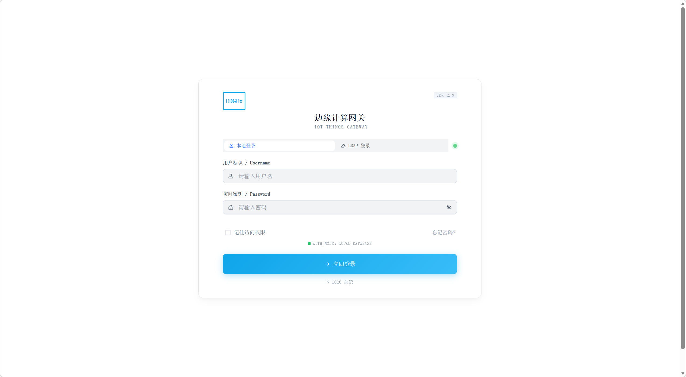

#### Dashboard


#### System Settings
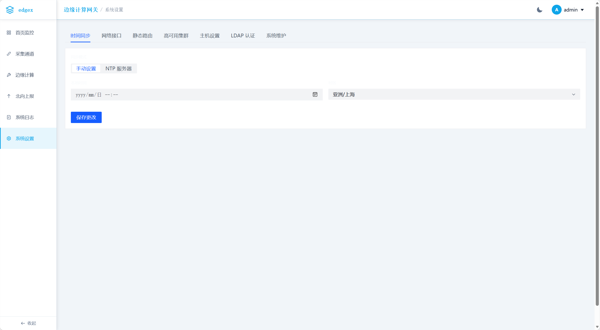

### 🔌 Southbound Acquisition (BACnet / OPC UA)

#### Channel List
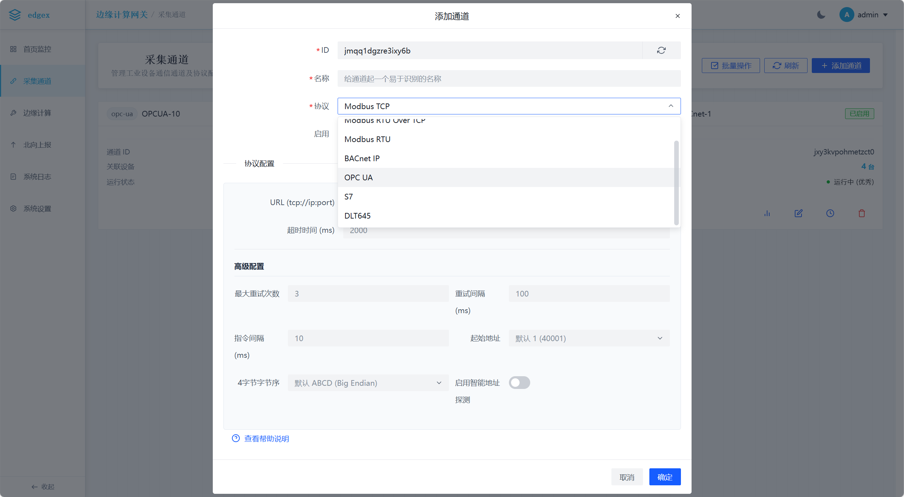

#### BACnet Device Discovery
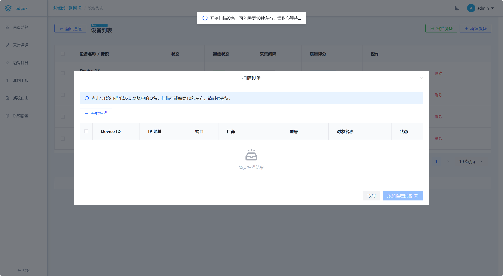

#### BACnet Discovery Results
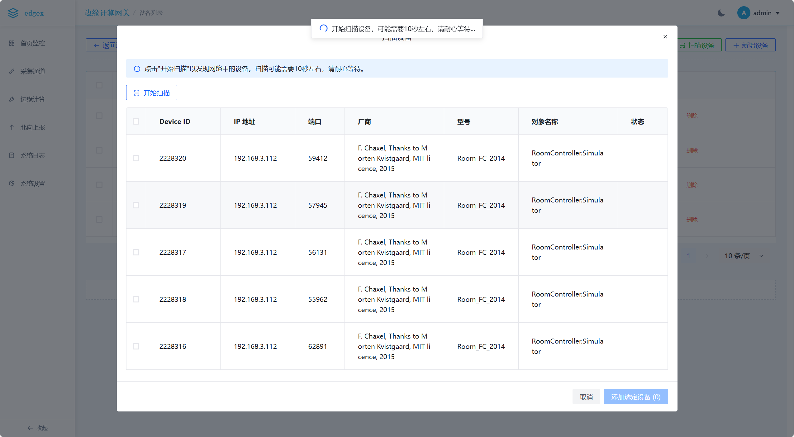

#### BACnet Point Scan
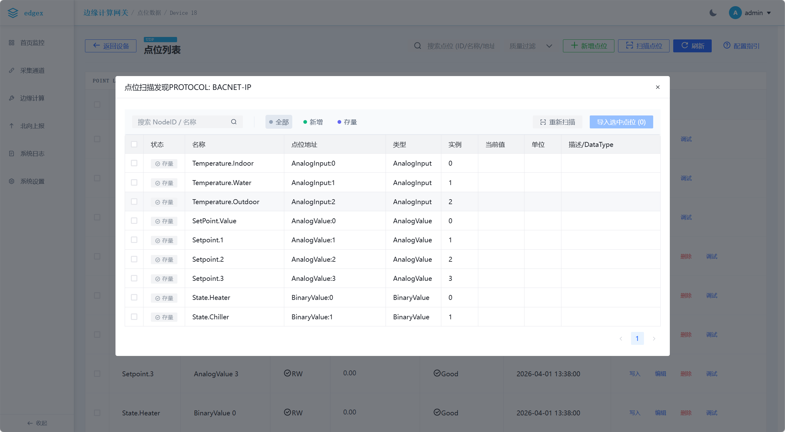

#### OPC UA Model Scan
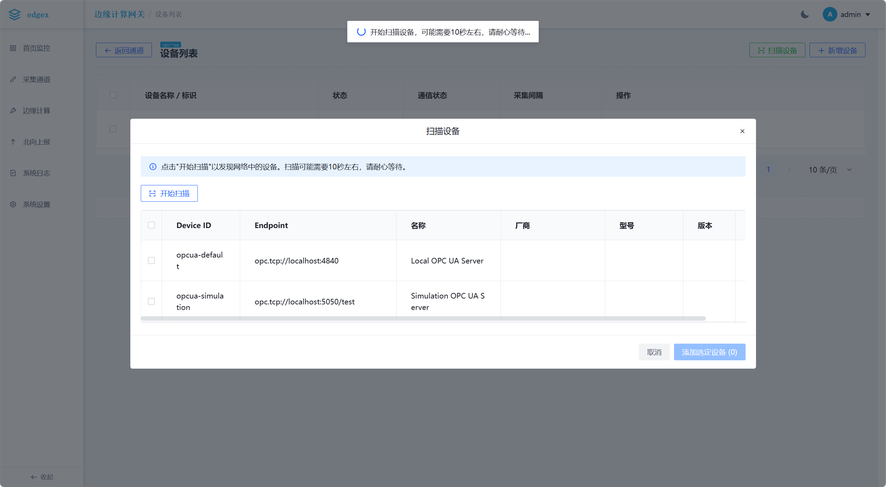

#### OPC UA Scan Results
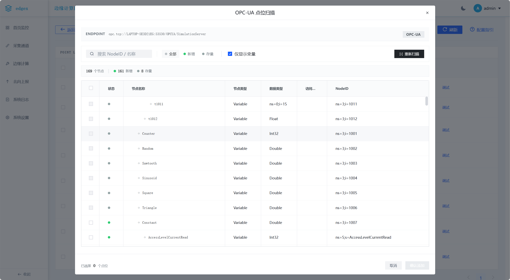

#### OPC UA Data Subscription
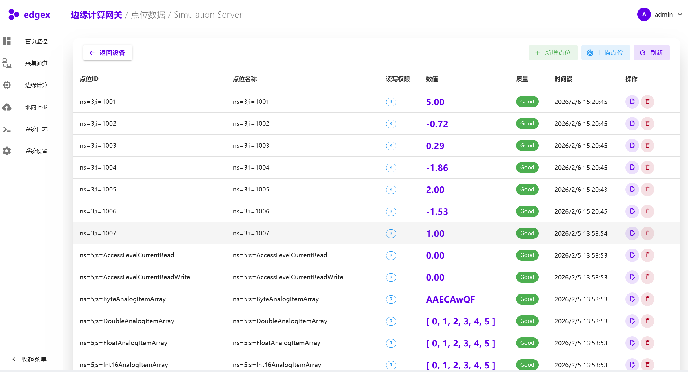

#### OPC UA Data Transformation
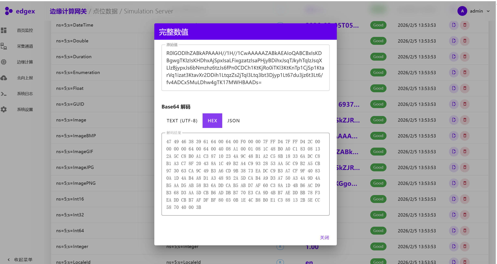

### 🧠 Edge Computing

#### Computation Monitor
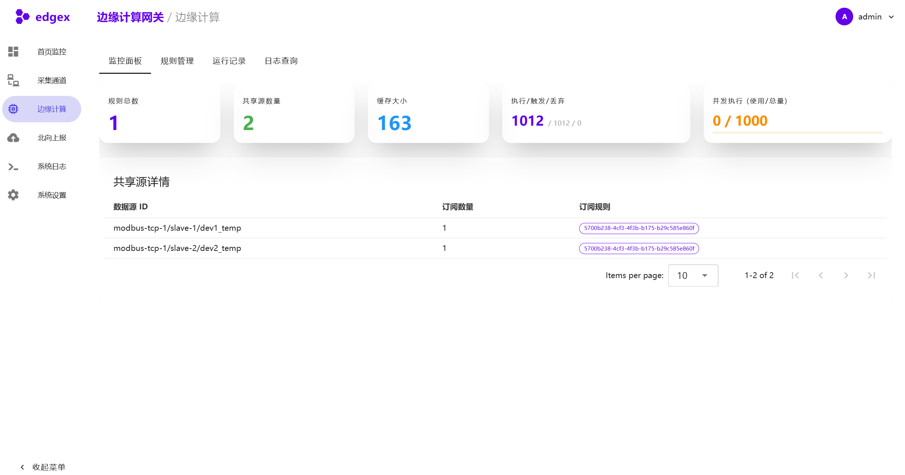

#### Rule Configuration
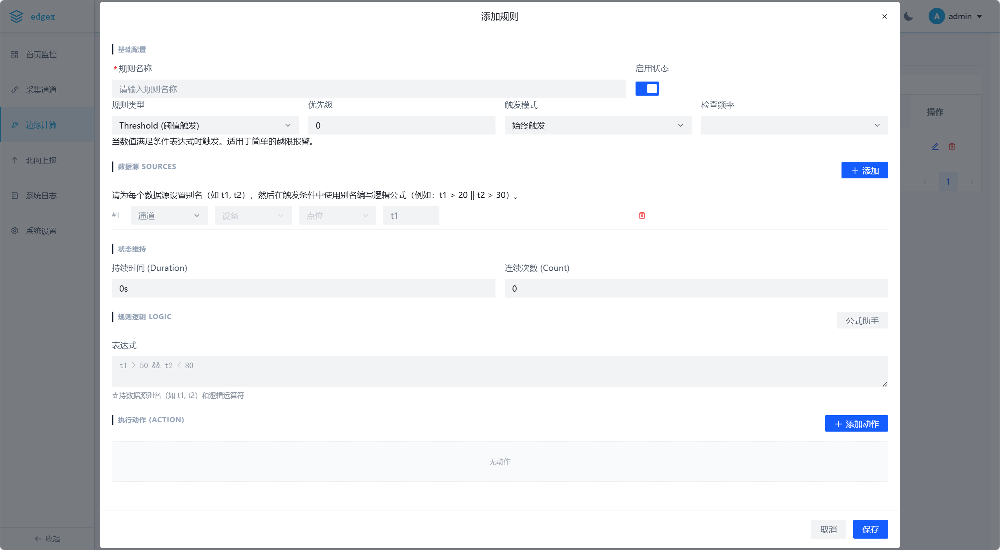

#### Supported Rule Types
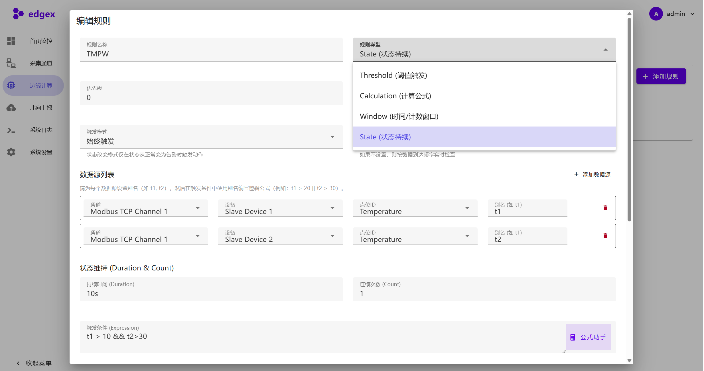

#### Supported Action Types
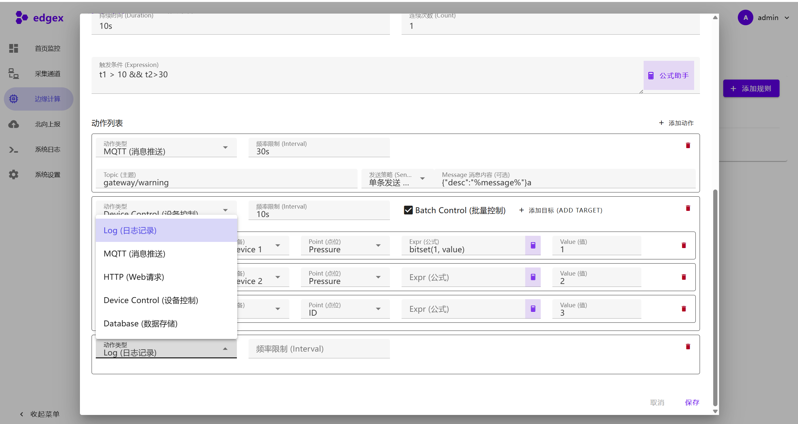


#### Rule Manual
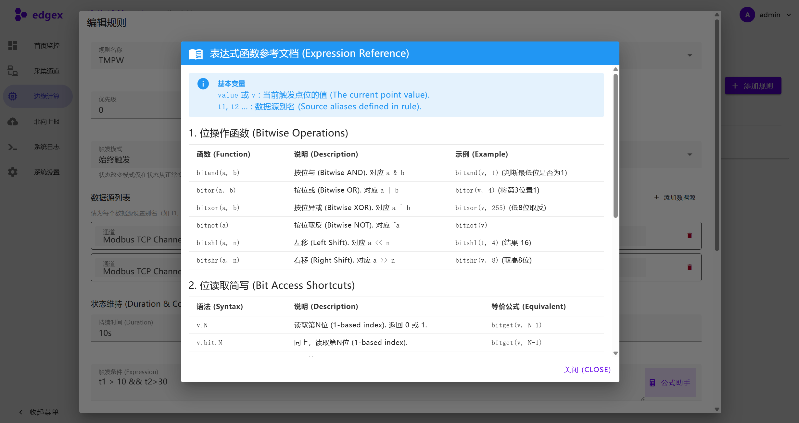

#### Rule Logs
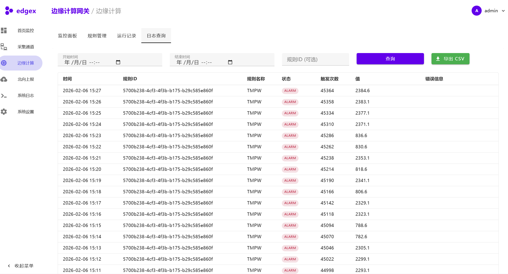

### ☁️ Northbound Data

#### Northbound Overview
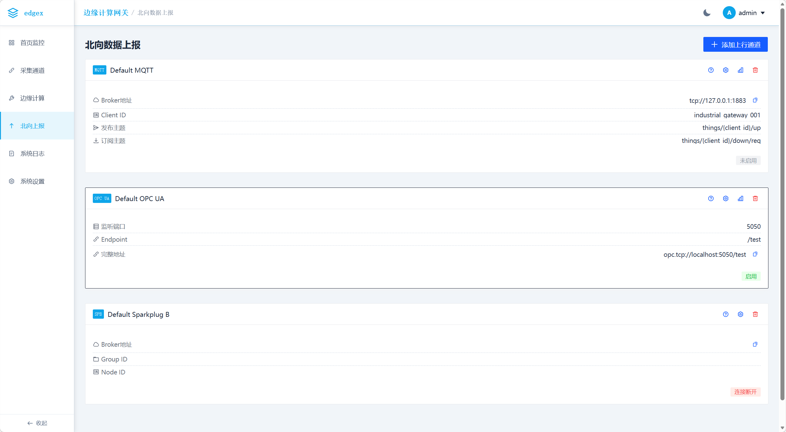

#### MQTT Monitor
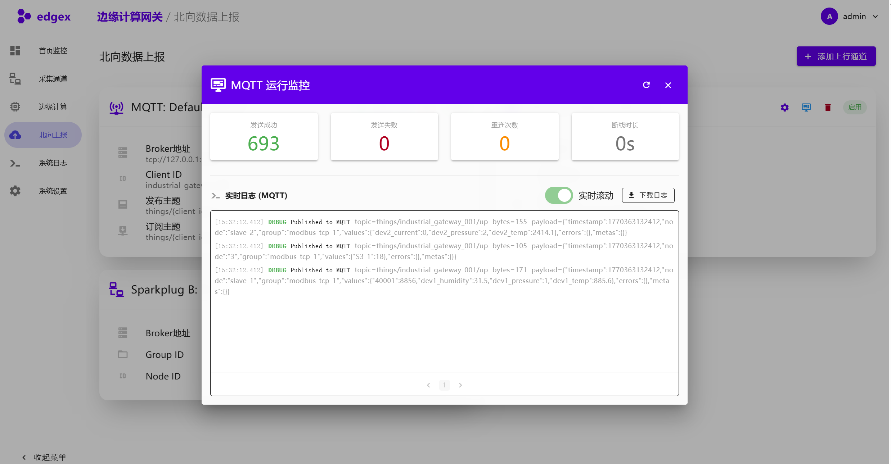

#### MQTT Manual
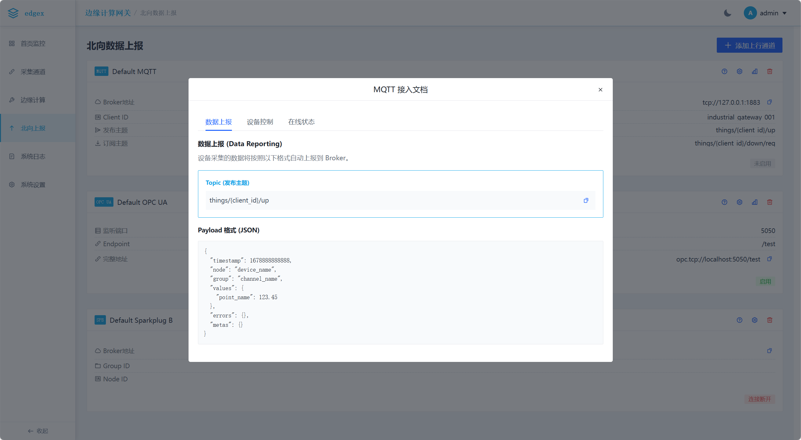

## 📄 License

Mozilla Public License 2.0 (MPL-2.0)